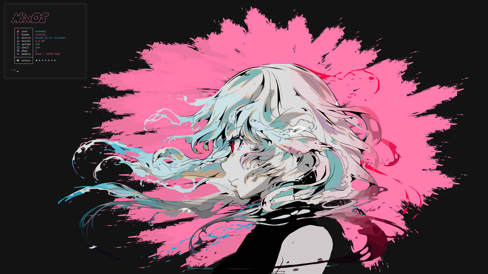
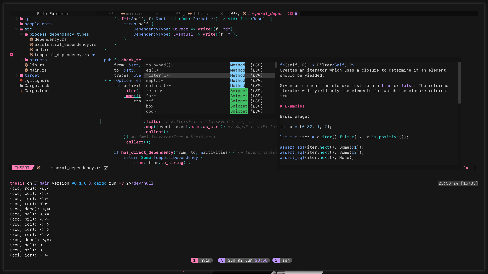
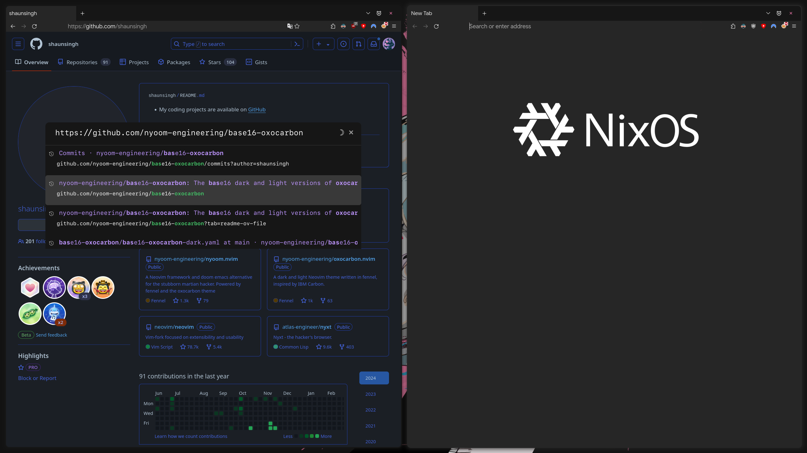
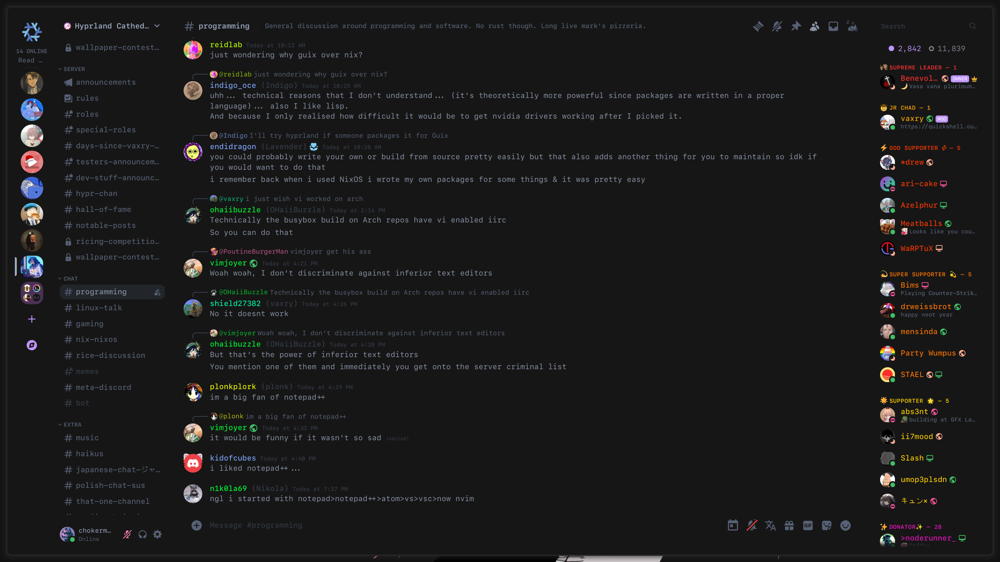

# WIP, do not just install this on your system please

 

## TODO:

- [ ] ideavimrc
- [ ] vimrc
- [ ] clipboard (cliphist / copyq)
- [ ] vimium-c + youtube-enhancer
- [ ] librewolf devtool cfg
- [ ] missing ff extensions
- [ ] vencord
- [ ] jetbrains cfg in nix (?)
- [ ] zed
- [ ] secrets
- [ ] spicetify
- [ ] fix nautilus theme (how?)
- [ ] add partition mounting on boot
- [ ] fix bootloader (and add ability to directly boot into windows)

## Credits:

- [raf](https://github.com/NotAShelf/nyx)
- [diniamo](https://github.com/diniamo/niqs)
- [zen](https://github.com/71zenith/nix-dots/)
- [shaunsingh](https://github.com/shaunsingh/nix-darwin-dotfiles)
